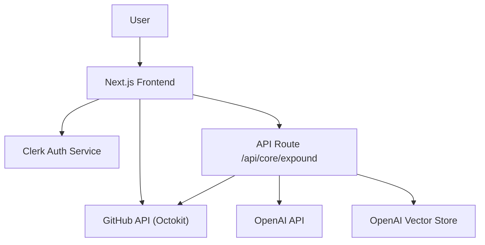

# Expounder

AI-powered dashboard for exploring GitHub repositories and generating comprehensive README files.

 

## Overview

Expounder is a Next.js web application that enables authenticated users to browse their GitHub repositories, inspect the file structure, preview file contents, and generate detailed README files using OpenAI.

## Architecture



## Features

- Authenticate with GitHub via Clerk and OAuth
- Browse repository file trees and preview raw file contents
- Generate comprehensive README files powered by OpenAI embeddings
- Optional storage of generated READMEs in Dropbox
- List and delete previously generated READMEs from Dropbox
- Concurrency control for efficient processing of large repositories
- Responsive UI built with React, Tailwind CSS, and Radix UI

## Installation

```bash
git clone <repository-url>
cd <repository-folder>
npm install
npm run dev
```

## Configuration

- OPEN_AI_KEY – API key for OpenAI
- GITHUB_CLIENT_ID – GitHub OAuth App Client ID
- GITHUB_CLIENT_SECRET – GitHub OAuth App Client Secret
- NEXT_PUBLIC_BASE_URL – Base URL for OAuth callback (e.g., http://localhost:3000)
- DROPBOX_ACCESS_TOKEN – (Optional) Access token to store generated READMEs in Dropbox

## Usage

Start the development server and navigate to http://localhost:3000. Sign in with your GitHub account, select a repository, browse files, and click "Generate notes" to create and download a comprehensive README.

## Contributing

- Fork the repository
- Create a feature branch: git checkout -b feature/YourFeature
- Commit your changes with clear messages
- Open a pull request and describe your changes
- Ensure all checks pass before merging

## Acknowledgements

- Next.js
- Clerk
- Octokit
- OpenAI
- Tailwind CSS
- Radix UI
- p-limit
- Zod
